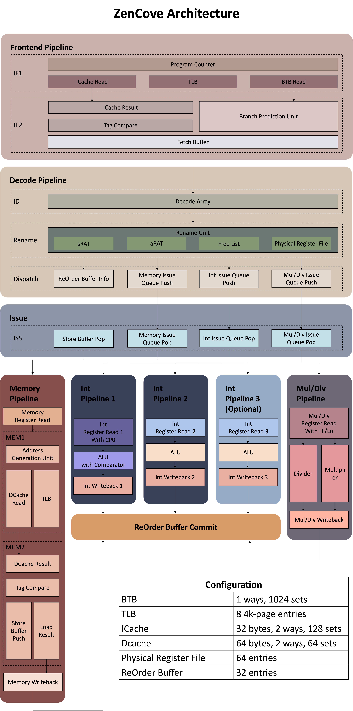

# ZOOM (ZenCove Out-of-Order Machine) -- 乱序多发射MIPS32 CPU

ZOOM is a highly configurable out-of-order MIPS32 processor, capable of booting Linux.
This is a project for *'Loongson Cup' National Student Computer System Capability Challenge* (NSCSCC2022), written by three undergraduate students.

该项目为清华大学ZenCove队在第六届“龙芯杯”全国大学生系统能力培养大赛 (NSCSCC2022) 的参赛作品。

项目作者为崔轶锴、张为、王拓为。

## 简介

ZOOM处理器在标准配置下为乱序四发射。前端流水线级数为5级，整数/乘除执行流水线4级，访存流水线5级，提交一级。

总体结构如下图：


龙芯杯性能测试环境下，主频在龙芯提供的开发板上（FPGA为Xilinx xc7a200tfbg676-2）可以达到111MHz。

支持的指令为 MIPS32 release 1 规范中除branch likely，ll/sc外的全部指令。

特殊地，由于axi总线不允许以3 byte为访问粒度进行访存，因此Unaligned load/store指令并不支持以uncached方式使用。

将此CPU核心装载到ZenCove Soc上，可以运行比赛时最新的linux内核v5.19-rc4，在linux下可以驱动VGA、PS/2、串口、Flash和LCD屏。

此项目基于scala v2.12.15、SpinalHDL v1.6.1编写，由[mill](https://github.com/com-lihaoyi/mill)构建。

CPU的主要特点：
- 高度可配置
  - 通过简单修改可以同时支持GSelect和GShare预测器
  - 可配置的指令缓存和数据缓存
  - 各个CPU阶段发射/提交宽度可配置
  - 用于重命名的物理寄存器数量可配置
  - ……
- 所有元件根据功能插件化
- 乱序执行

[决赛展示视频](https://www.bilibili.com/video/BV1ja41157Tm)

## 项目编译

- mycpu_top: `mill ZenCove.runMain zencove.soc.CPUTopVerilog`
- CPUCore: `mill ZenCove.runMain zencove.soc.CPUCoreVerilog`
- 命令行参数
  - `--scale=`，处理器规模，在[ZencoveConfig#ZencoveConfig](./ZenCove/src/zencove/ZencoveConfig.scala)中定义
  - `--no-timer`, 关闭时钟中断
  - `--sim`, 生成trace用接口

### 使用 GitLab CI

将初赛提交包 (nscscc2022_group_qualifier_submission) 放在`official/`目录下以使用CI。目前的CI配置提供了生成Verilog、综合功能/性能/系统测试的例子。

## 文件说明

1. doc
   - 该目录下为开发过程中的一些备忘以及项目的初赛和决赛报告。
   - 备忘包括一些部件的设计说明、使用方法、以及展示功能需要在主机端和CPU上执行的指令等。这里可以看到部分设计思路和设计原因。
   - [初赛报告](./doc/qualifier_report.pdf)
   - [决赛报告](./doc/final_report.pdf)
   - [决赛答辩PPT](./doc/final-pre.pdf)

3. rtl
   - 该目录下为功能测试、性能测试和系统测试中使用的ip核
   - 包含顶层crossbar（用于集束CPU暴露的三个AXI接口），配置好的乘除法器（包括计算流水线级数等）

4. script
   - 用于编译裸机程序的汇编
   - 默认使用的工具链为[mips-mti-elf](http://codescape.mips.com/components/toolchain/2020.06-01/downloads.html)
   - 将会从testcase/asm中寻找汇编
   - 有可供windows与linux使用的两个版本，可以分别编译带简易异常处理函数和无异常处理的共4个版本
   - 使用方法举例: `./script/compile_basic.sh add16` 

5. testcase
   - 测试汇编目录
   - 所有无异常处理汇编均应以下列语句开头:
     ```asm
     #include <regdef.h>
     .section .text
     .globl _start
     _start:
     ```
   - 所有需要异常处理的汇编应以下列语句开头:
     ```asm
     #include <regdef.h>
     #include <mipsregs.h>
     #include <unistd.h>
     #include <exception.h>
     .section .text.init
     .globl _start
     _start:
     ```
   - 可以通过`.set noreorder`来保证不自动填充延迟槽

6. ZenCove
   - CPU工程目录，下面一节将进行详细说明

## CPU工程文件介绍（ZenCove目录）

1. blackbox
   - 黑盒，包含ip核和部分xpm原语的封装，让spinal可以自动例化ip核或xpm原语并连线
   - ip核包括ila，乘除法器和crossbar，详细使用方法见文件内注释
   - xpm原语包括xpm_fifo和xpm_memory。其中，我们进一步封装了BRAM，让Spinal在生成ram的电路时可以使用BRAM而不是寄存器。
2. builder
   - 参考Vexriscv编写的流水线搭建工具
   - 详细说明请参考[VexRiscv仓库](https://github.com/SpinalHDL/VexRiscv)以及[设计模式说明](./doc/design_mode.md)
   - 流水线基本信号的说明可以参考[Stage.scala](./ZenCove/src/zencove/builder/Stage.scala)中的注释
3. core
   - CPU的核心功能部件和信号说明，具体功能如下表
   - | 文件名 | 功能说明 | 类型 | 流水线阶段 |
     | ----- | --------| -----| ----------|
     | AGU   | 地址生成单元，用于LSU进行地址的计算和对齐 | 组合逻辑 | 访存流水线-MEM1 |
     | ALU   | 计算单元 | 组合逻辑 | 整数流水线-EXE |
     | BRU   | 分支计算单元 | 组合逻辑 | 整数流水线-EXE |
     | BusTraits | CPU对外的3个AXI接口的抽象 | 抽象接口 | / |
     | BypassNetwork | 整数流水线前传网络 | 插件 | 整数流水线 |
     | CommitTraits | 指令提交的接口抽象，如异常提交接口 | 抽象接口 | / |
     | Comparator | 比较器 | 组合逻辑 | 整数流水线-EXE |
     | CompressedFIFO | 压缩队列 | 插件 | / |
     | CompressedIQ | 发射队列 | 插件 | / |
     | ConfigRegisters | CP0中只读的配置寄存器 | 插件 | / |
     | CPU | CPU中的流水线和流水阶段定义 | 流水线声明 | / |
     | CPUCore | CPU核心文件，用于组装各个流水线和CPU | CPU顶层 | / |
     | CPUSignals | 全局流水线信号，用于标量和双发射CPU，**弃用** | 流水线信号 | / |
     | DCacheWriteback | 写回数据cache | 插件 | 访存流水线-MEM1->MEM2 |
     | DecoderPipeline | 前端，译码流水线定义 | 流水线声明 | 译码流水线-ID->DISPATCH |
     | DecoderArray | 译码器 | 插件 | 译码流水线-ID |
     | DecoderSignals | 译码流水线中的流水线信号 | 流水线信号 | 译码流水线-ID->DISPATCH |
     | DirtyBitsManager | 维护Dcache的Dirty位 | 插件 | 访存流水线 |
     | ExceptionHandler | 处理异常提交和状态转移 | 插件 | / |
     | ExceptionMux | 用于判断异常优先级，保留最高优先级异常并提交 | 流水线信号 | / |
     | ExecutePipeline | 整数执行流水线定义 | 流水线声明 | 整数流水线-ISS->WB |
     | FetchBuffer | 取指令缓冲 | 插件 | 取指流水线-IF2->译码流水线-ID |
     | FetchPipeline | 取指流水线定义 | 流水线声明 | 取指流水线IF1->IF2 |
     | HiLoRegFile | HiLo寄存器 | 寄存器堆 | 乘除流水线-RRD+WB |
     | ICache | 采用Reorder的指令缓存 | 插件 | 取指流水线-IF1->IF2 |
     | ICacheNoReorder | 不采用Reorder的指令缓存 | 插件 | 取指流水线-IF1 |
     | InstAddrTranslate | 取指TLB查询模块 | 插件 | 取指流水线-IF1 |
     | InterruptHandler | 中断处理器，用于生成中断信号等待某指令take | 插件 | / |
     | IntExecute | 整数指令执行流水线主干 | 插件 | 整数流水线-ISS->WB |
     | IntIssueQueue | 整数指令发射队列 | 插件 | 译码流水线-DISPATCH->整数流水线-ISS |
     | LoadPostProcess | 用于将访存结果根据地址和类型对齐并添加符号位 | 组合逻辑 | 访存流水线-MEM2 |
     | MemExecute | 访存流水线主干 | 插件 | 访存流水线-ISS-WB |
     | MemIssueQueue | 访存指令发射队列 | 插件 | 译码流水线-DISPATCH->访存流水线-ISS |
     | MemPipeline | 访存流水线定义 | 流水线声明 | 访存流水线-ISS->WB |
     | MemSignals | 访存流水线信号 | 流水线信号 | 访存流水线-ISS->WB |
     | MIPS32Decode | 译码器用，指令微码生成规则 | 组合逻辑 | 译码流水线-ID |
     | MulDivExecute | 乘除流水线主干 | 插件 | 乘除流水线-ISS->WB | 
     | MulDivIssueQueue | 乘除流水线发射队列 | 插件 | 译码流水线-DISPATCH->乘除流水线-ISS |
     | package | 未完全迁移的全局流水线信号 | 流水线信号 | / |
     | PhysRegFile | 物理寄存器堆 | 寄存器堆 | 各执行流水线-RRD+WB |
     | ProgramCounter | 计算NextPC | 插件 | 取指流水线-IF1 |
     | RenameByPRF | 物理寄存器重命名 | 插件 | 译码流水线-RENAME |
     | RenameHiLo | HiLo寄存器重命名 | 插件 | 译码流水线-RENAME |
     | ReorderBuffer | 重排序缓冲 | 插件 | 指令提交 |
     | ROBFIFO | 重排序缓冲队列 | 插件 | 译码流水线-DISPATCH+指令提交 |
     | SpeculativeWakeupHandler | 推测唤醒控制器 | 插件 | 访存流水线-MEM1->MEM2+各执行流水线-ISS |
     | StatusProvider | CPU状态抽象接口 | 抽象接口 | / |
     | StoreBuffer | Store缓冲器，用于提交LDU和Store指令 | 插件 | 访存流水线-ISS->WB |
     | TLB | 地址转换缓冲 | 插件 | 取指流水线-IF1+访存流水线-MEM1 |
     | UncachedAccess | Uncached访问状态机 | 插件 | 访存流水线-MEM2 |
     | WaitHandler | 处理wait操作，等待中断信号 | 插件 | / |
   - bpu内为分支预测相关，包括各种预测器的BTB和预测逻辑以及RAS，可供参考，部分预测器不可接入
4. enum
   - 各种枚举类信号的定义，如ALU的Operand，Load/Store类型等
5. misc
   - 杂项，目前只包含一个用于加速的Uncached AXI Buffer
6. model
   - 各种信号组（Bundle）的声明，包括存储类型（如BTB行，Cache行），微码，接口等等
7. peripheral
   - 用于soc的各种总线部件，如crossbar，LCD控制器等
   - 控制器翻译自参考资料的仓库以及龙芯官方提供的SoC，**未经过详细测试，不保证可用**
8. sim
   - Verilator仿真相关的部件模型
   - 单元测试的构造例子（DecoderSimRTL）
   - DataProvider生成指令和激励
9. soc
   - 顶层文件
   - CPUCoreVerilog生成CPUCore供zencove-soc使用
   - CPUTopVerilog生成mycpu_top供功能、性能、系统测试使用
   - CLIConfig用于读取命令行参数
10. util
    - 任务杂项，包含Axi重命名任务等功能
    - 封装好的基于寄存器的多口FIFO
    - 重排序RAM
    - 三态门定义
    - 常用类型
    - CP0寄存器的读写功能定义
    - MultiBankingRAM等未在项目中使用的**未经充分测试，不保证可用**
11. MIPS32
    - 指令译码匹配逻辑
    - CP0寄存器的地址和Select
    - 异常编号
12. ZencoveConfig
    - CPU配置文件
    - 通过调整参数来改变CPU支持的功能以及内部实现
    - 部分参数组合可能不兼容

## 建议和说明
- 通过`Service[]`系列函数可以找到CPU中的其他**插件**，这个可以简化连线的难度
- 请先理解[Stage.scala](./ZenCove/src/zencove/builder/Stage.scala)中的流水线信号，非常常用
- 在使用信号时一定要小心，你想用的很有可能是`CombInit`而不是赋值号`:=`
- 写MIPS的CPU时，一定要格外注意**延迟槽**的处理逻辑
- LLCL-MIPS中提供的[对于SpinalHDL的建议](https://github.com/huang-jl/LLCL-MIPS/blob/main/README.md#%E5%AF%B9%E4%BA%8Espinalhdl)

## 致谢
除了队员的努力之外，我们还要特别感谢往届的学长，包括高一川、陈晟祺、陈嘉杰、黄嘉良。

## 参考资料

- 姚永斌编著. 超标量处理器设计. 北京：清华大学出版社, 2014.04.
- The Berkeley Out-of-Order Machine (BOOM)
[文档](https://docs.boom-core.org/en/latest/sections/intro-overview/boom.html)
[仓库](https://github.com/riscv-boom/riscv-boom)
- [Vexriscv](https://github.com/SpinalHDL/VexRiscv)
- [TrivialMIPS](https://github.com/trivialmips)
- [LLCL-MIPS](https://github.com/huang-jl/LLCL-MIPS)
- SpinalHDL
[文档](https://spinalhdl.github.io/SpinalDoc-RTD/master/index.html)
[仓库](https://github.com/SpinalHDL/SpinalHDL)

