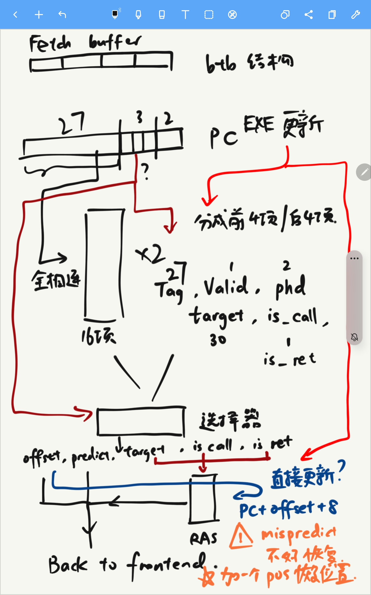

# 预测器设计描述

整体预测器包括静态分支的方向、目标预测，动态分支(return)的目标预测。

这里描述BTB，RAS的设计逻辑

暂时先不设计多级的predictor，逻辑有些复杂

总体逻辑如下图：

## BTB

32位地址分为 `27(Tag) + 3(Instruction offset, IO) + 2(Byte offset, BO)`.

### 结构

BTB的结构为2个16项的全连接表，表项结构如下：

27位`tag`，30位`target`，2位`phd`，1位`valid`，1位`is call`，1位`is ret`

其中`phd`为2位的预测状态机

`is call`代表这个指令是否是“跳转且link了ra寄存器”

`is ret`表示这个指令是否是“register jump based on ra”

两个表分别存储前4项和后4项的相关信息

### 查询方式

由`PC`获得`Index`，查询2个表的全部项目，计算`ok = (tag === tag) & valid & phd >=2`，连到2路选择器

根据`PC`的`IO`，取出`id >= PC_IO & ok`的最小`id`，获取`id, target, is_call, is_ret`

若没有对应项，则置`predict_jump`为`false`表示没有预测

若`is_ret`或`predict_jump`为`false`，则向前端返回`offset, predict_jump, target`

否则需要查询RAS

### 修改方式

一个branch指令提交之后，直接修改对应项

TODO：有可能太晚了，导致许多预测失败

## RAS

### 结构

16项30位地址栈，4位`next_entry`

### 查询/修改方式

当提供`is_call & predict_jump`时，压入`PC + offset + 8`，覆盖`next_entry`项，`next_entry`加1.

当提供`is_ret`时，弹出，`next_entry`减1，覆盖BTB提供的`target`

Q: mis-predict的时候，RAS可能会出现错位的问题。也许不应该在IF这里直接改

A: 只要不错位，就可以接受，所以给预测指令带一个`recover_pos`，若指令预测失败，恢复`next_entry`即可

Q: 需要valid吗？

A: 不需要，用`jr ra`等指令返回时，一般都先使用`jal ra`指令跳转

## 分支方向预测

`zencove.core.bpu`中实现了局部两位饱和计数器，Gshare，Gselect (correlating predictor)，BHT-PHT两级分支预测，局部+全局混合预测器。最终以效果和简单性综合选择Gselect作为分支方向预测。

### 局部两位饱和计数器

以PC低位寻址PHT计数器，相当于BTB中每一项对应的计数器。

### Gshare

以全局历史和PC做hash（通常是与部分位xor）寻址PHT计数器。全局历史可以记录的比较长。

### Gselect

以全局历史与PC部分位做拼接寻址PHT计数器。降低了不同PC冲突的可能性，但也减少了全局历史长度。

### 两级分支预测

用PC低位寻址BHT中局部分支历史，用局部历史寻址PHT计数器。

### 混合分支预测

采用一个局部分支预测器，一个全局分支预测器，一个计数器表对两者谁更靠谱进行预测（对预测器的预测）。
其中对预测器的预测采用对两个预测器过去预测是否准确进行饱和计数。
